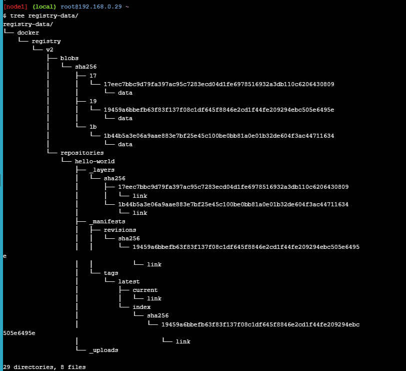
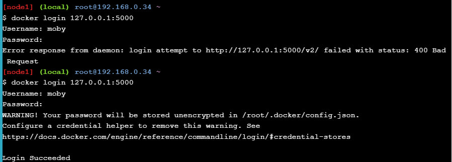
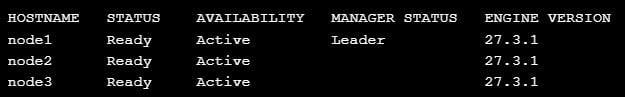
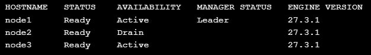

## Docker registry for Linux Part 1

Содержимое registry:



## Docker registry for Linux Parts 2 & 3



Неуспешная и успешная аутентификации

## Docker Orchestration Hands-on Lab



Узлы в состоянии **Active**



Узел в состоянии **Drain**

### Восстановилась ли работа запущенного сервиса на этом узле после перевода из Drain в Active?

Нет. При переводе ноды в режим `Drain` планировщик Swarm намеренно останавливает и переносит задачи с этой ноды на прочие доступные узлы; после возвращения ноды в состояние `Active` она становится вновь пригодной для планирования задач, однако ранее эвакуированные задачи не восстанавливаются автоматически. Для восстановления запущенных экземпляров требуется инициировать перераспределение задач вручную.

### Что необходимо сделать, чтобы запустить работу службы на этом узле снова?

Возможные корректные способы инициировать запуск задач на возвращённой в `Active` ноде:

1. Принудительное перезапускание (обновление) сервиса — заставляет планировщик перераспределить задачи и создать новые экземпляры, например:

```
docker service update --force sleep-app
```

2. Явное изменение числа реплик — масштабирование вызывает пересчёт и запуск задач в кластере (включая вновь доступную ноду):

```
docker service scale sleep-app=N
```

Где `N` — требуемое число реплик. Оба метода приводят к перераспределению задач планировщиком Swarm и могут быть использованы в зависимости от политик деплоя и требований к доступности.

## Swarm stack introduction

### Как конфигурируется количество нодов (реплик) в стэке?

Количество нодов (реплик) для каждого сервиса в стеке задаётся через параметр replicas в секции deploy `docker-compose.yml` файла.

```
vote:
  # ...
  deploy:
    replicas: 2
worker:
  # ...
  deploy:
    replicas: 2
```

Docker Swarm запустит:

- 2 реплики сервиса `vote`
- 2 реплики сервиса `worker`

### Как организуется проверка жизнеспособности сервисов в docker-compose.yml?

1. Прямая проверка жизнеспособности через `healthcheck`
2. Зависимости между сервисами с условием готовности (`depends_on` -> `service_healthy`)
